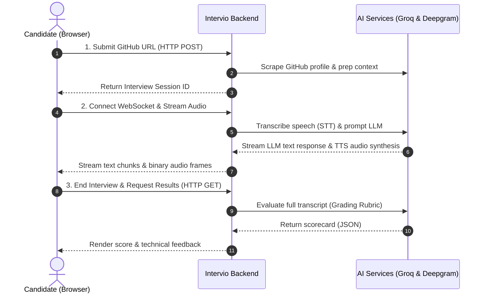

# Intervio 🎙️

**Intervio** is a real-time, voice-driven AI technical interviewer designed to conduct personalized software engineering mock interviews. By analyzing a candidate's GitHub profile, the AI customizes the questions to focus on their real-world projects and technologies. The entire experience happens in real-time using low-latency WebSockets, real-time speech-to-text (STT), and voice synthesis (TTS), concluding with a structured technical grading report.

---

## 🌟 Key Features

- **GitHub Ingestion:** Scrapes public repository metadata (names, descriptions, languages, topics, and stars) to dynamically customize interview topics and difficulty.
- **Low-Latency Voice Stream:** Audio streams bidirectionally over WebSockets (`ws`), creating a seamless, near-zero lag conversation.
- **Real-time Transcription (STT):** Captures user answers instantly via **Deepgram Live Speech-to-Text**.
- **Context-Aware AI Interviewer:** Tailors responses and follow-ups dynamically utilizing the **Groq SDK** and **Llama-3.1-8b-instant** model.
- **Speech Synthesis (TTS):** Streams natural speech output back to the candidate via **Deepgram's `aura-asteria` Voice Model**.
- **Echo-Resistant Web Audio Queue:** Uses HTML5 `AudioContext` and dynamic microphone muting/unmuting on the frontend to prevent audio feedback loops.
- **Strict Grading Rubric:** Conducts evaluation on the full transcript using an LLM evaluator to output a feedback summary and a technical score (0-10) saved in the database.

---

## 🏗️ Architecture & Tech Stack

This project is structured as a **monorepo** managed by **Turborepo** and powered by **Bun**.

```
Intervio/
├── apps/
│   ├── frontend/         # React SPA (TailwindCSS, WebSockets, AudioContext, VoiceOrb)
│   └── backend/          # Express + WebSocket Server (Groq, Deepgram, Redis, Prisma)
├── packages/
│   ├── ui/               # Shared React UI components
│   ├── eslint-config/    # Monorepo ESLint configurations
│   └── typescript-config/# Shared TSConfigs
```

### Technical Stack

- **Runtime:** Bun
- **Monorepo Tooling:** Turborepo
- **Frontend:** React 19, React Router v7, TailwindCSS v4, Lucide React, Radix UI, Sonner
- **Backend:** Express, WebSocket (`ws`), Axios
- **Database & State:** PostgreSQL (via Prisma ORM) & Redis (for ephemeral session store and conversation buffer)
- **AI Services:** Groq (Llama-3.1-8b), Deepgram (STT & TTS)

---

## System Flow

The diagram below outlines the end-to-end flow of the voice session and evaluation.



---

## ⚙️ Environment Variables

Copy the example environment files and set the required variables.

### Backend (`apps/backend/.env`)

```ini
DATABASE_URL="postgresql://..." # PostgreSQL connection string
REDIS_URL="redis://localhost:6379"
GROQ_API_KEY="gsk_..."
DEEPGRAM_API_KEY="..."
FRONTEND_URL="http://localhost:3000"
GITHUB_TOKEN="" # Optional: To prevent rate limiting on GitHub API
```

### Frontend (`apps/frontend/.env`)

```ini
BACKEND_URL="http://localhost:3001"
```

---

## 🚀 Getting Started

Follow these steps to run Intervio locally:

### 1. Prerequisites

Ensure you have **Bun** and **Docker** (or local instances of **PostgreSQL** and **Redis**) installed:

```bash
# Verify Bun installation
bun --version
```

### 2. Install Dependencies

Run the install script at the root:

```bash
bun install
```

### 3. Setup Database

Initialize and apply database migrations to your PostgreSQL database:

```bash
cd apps/backend
bunx prisma migrate dev
```

### 4. Run Development Servers

Start both the React frontend and the backend server concurrently:

```bash
# From root directory
bun run dev
```

- **Frontend:** `http://localhost:3000`
- **Backend:** `http://localhost:3001`

---

## 🛠️ Monorepo Scripts

Run these scripts from the root directory:

| Script          | Command               | Description                                        |
| --------------- | --------------------- | -------------------------------------------------- |
| **dev**         | `bun run dev`         | Runs the frontend and backend in hot-reload mode.  |
| **build**       | `bun run build`       | Compiles applications and packages for production. |
| **lint**        | `bun run lint`        | Runs ESLint across all workspaces.                 |
| **format**      | `bun run format`      | Formats codebase using Prettier.                   |
| **check-types** | `bun run check-types` | Performs TypeScript typechecking.                  |
